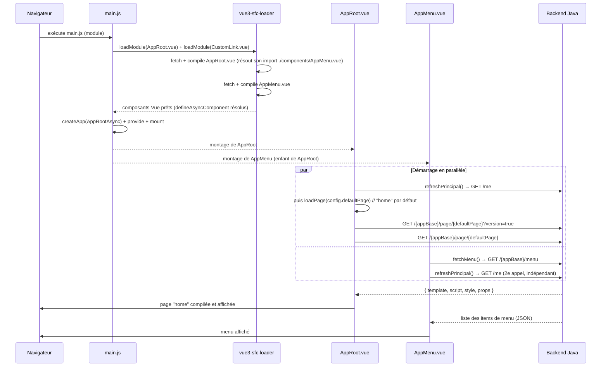
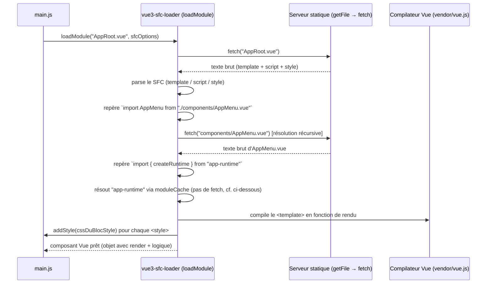
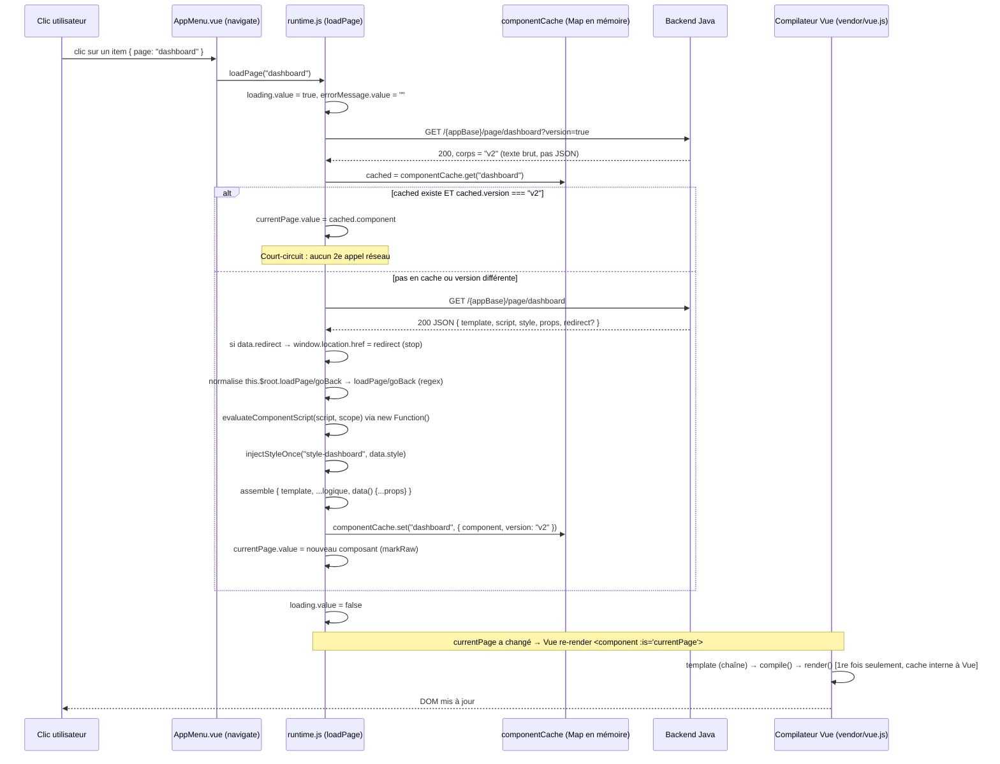
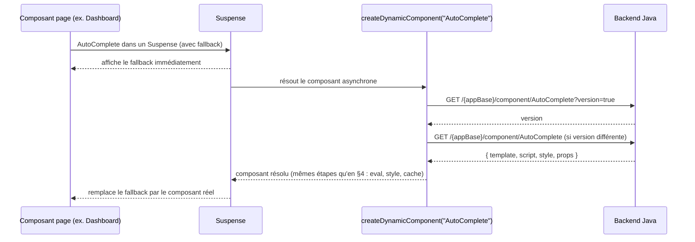
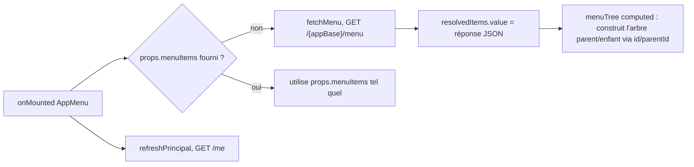
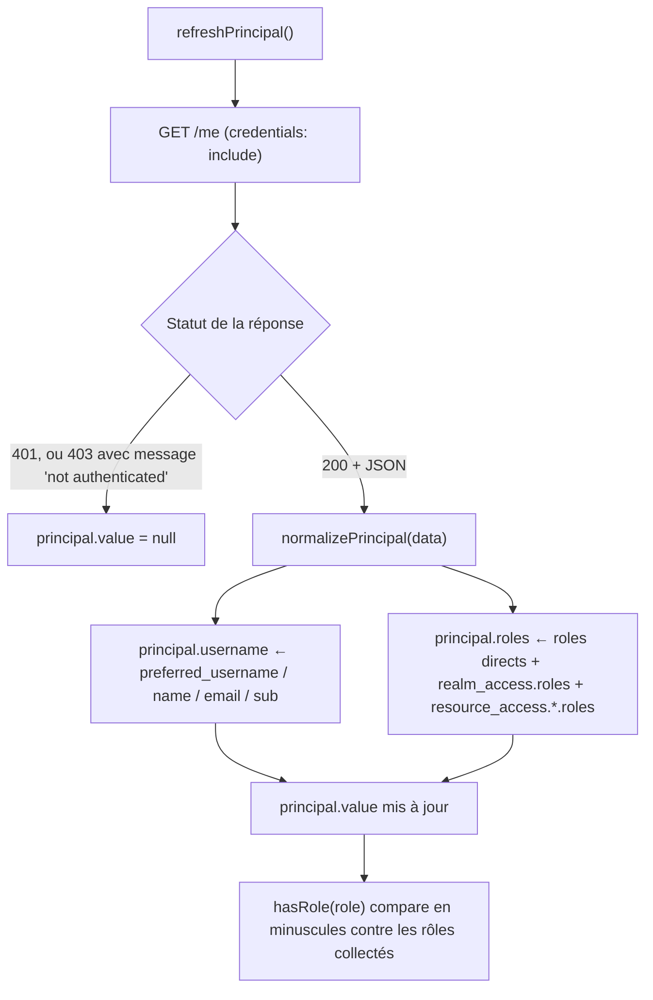
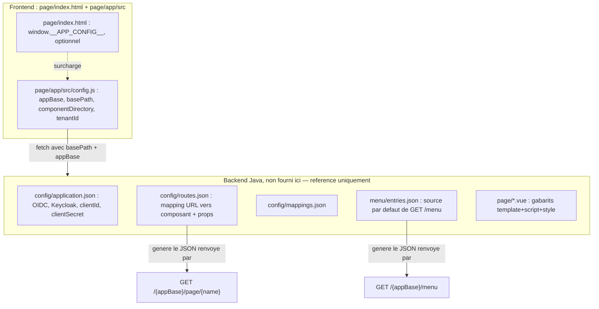
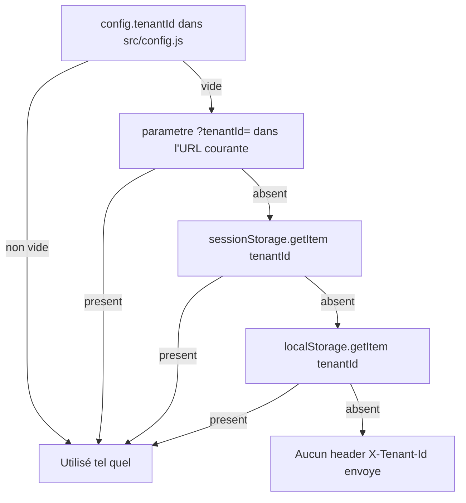

# Fonctionnement interne du template PayOS UI (pure VueJS)

Ce document explique **comment l'application fonctionne concrètement** :
point d'entrée, cycle de démarrage, chemin exact suivi par une requête de
page envoyée par le navigateur, fichiers de configuration, et qui appelle
qui. Il complète le `README.md` du projet (qui, lui, documente surtout le
*mapping* avec la version Nuxt d'origine).

Tous les noms de fichiers et de fonctions ci-dessous correspondent
exactement au code livré dans `vue-app/`.

---

## 1. Point d'entrée

À la racine du projet ne se trouvent que les ressources backend de
référence (`config/`, `menu/`). Le dossier `page/` regroupe à la fois les
gabarits `.vue` backend et l'application frontend elle-même
(`index.html` + `app/`) :

```
vue-app/
├── config/, menu/                (ressources backend, cf. §8)
└── page/
    ├── Home.vue, Dashboard.vue, … (gabarits backend, cf. §8)
    ├── index.html                 ← point d'entrée réel
    └── app/
        └── src/main.js            ← premier fichier JS exécuté
```

```
page/index.html
    └── <script type="module" src="./app/src/main.js">
```

`index.html` (dans `page/`) ne fait que deux choses : afficher un
`<div id="app">` (le point de montage) et charger `app/src/main.js` comme
**module ES natif** — pas de bundler, pas de transpilation, le navigateur
exécute ce fichier tel quel.

`app/src/main.js` est le **seul** point de bootstrap de toute l'application
(dans les sections suivantes, tous les chemins comme `src/...` ou
`vendor/...` sont relatifs à `page/app/`). Il exécute, dans cet ordre exact :

```js
const sfcOptions = { moduleCache: {...}, getFile, addStyle };  // 1. options du compilateur SFC
const AppRootAsync = Vue.defineAsyncComponent(() => loadModule(appRootUrl, sfcOptions));    // 2.
const CustomLinkAsync = Vue.defineAsyncComponent(() => loadModule(customLinkUrl, sfcOptions)); // 3.
const runtime = createRuntime();          // 4. instancie le moteur runtime.js
const app = Vue.createApp(AppRootAsync);  // 5. crée l'app Vue avec le composant racine (async)
app.provide("runtime", runtime);          // 6. rend le runtime injectable partout
app.config.globalProperties.$runtime = runtime; // 7. alias this.$runtime (Options API)
app.directive("click-outside", clickOutside);   // 8. directive globale
app.component("CustomLink", CustomLinkAsync);   // 9. composant global <CustomLink>
app.mount("#app");                        // 10. montage réel dans le DOM
```

`AppRoot.vue`, `AppMenu.vue` et `CustomLink.vue` sont désormais de véritables
fichiers `.vue`, compilés à la volée par `vue3-sfc-loader` — voir §3 pour le
détail de ce mécanisme.

Il n'y a **qu'une seule instance** du runtime (créée à la ligne 4), partagée
par toute l'application via `provide`/`inject('runtime')`. C'est l'équivalent
exact de ce que faisait `$runtime` (fourni par `useNuxtApp()`) côté Nuxt.

---

## 2. Cycle de démarrage (au chargement de la page)

Dès que `app.mount("#app")` s'exécute, Vue construit l'arbre de composants :
`AppRoot.vue` (racine) contient `<AppMenu />`. Les deux composants ont
chacun leur propre hook `onMounted()`, qui se déclenchent **en parallèle**
et de façon indépendante — mais avant que `onMounted()` puisse s'exécuter,
`vue3-sfc-loader` doit d'abord avoir compilé les `.vue` correspondants :



**Point notable** : `/me` est appelé **deux fois** au démarrage (une fois
par `AppRoot`, une fois par `AppMenu`), chacun gérant sa propre copie du
résultat via le même `principal` réactif du runtime partagé. C'est le
comportement exact de l'original Nuxt (chaque composant appelait
`refreshPrincipal()` de son côté) — ce n'est pas une régression du portage.

---

## 3. Compilation des `.vue` à la volée (`vue3-sfc-loader`)

C'est la vraie nouveauté par rapport à la version "JS pur" précédente :
`AppMenu`, `AppRoot` et `CustomLink` sont maintenant écrits comme de
véritables fichiers `.vue`, jamais transformés par un quelconque outil de
build — leur compilation a lieu **dans le navigateur**, à l'exécution.



Points importants à connaître pour modifier ces trois fichiers :

- **`moduleCache: { vue: Vue, "app-runtime": ..., "app-config": ... }`**
  (défini dans `main.js`) — `vue3-sfc-loader` embarque son propre babel,
  mais ne sait pas parser un `.js` **externe** qui utilise `import`/`export`
  (limitation connue de la bibliothèque, voir
  [issue #14](https://github.com/FranckFreiburger/vue3-sfc-loader/issues/14) :
  la même erreur — *"'import' and 'export' may appear only with
  'sourceType: module'"* — a été rencontrée et vérifiée lors du
  développement de ce portage). `runtime.js` et `config.js` sont donc
  importés normalement (ES module natif) dans `main.js`, puis exposés aux
  `.vue` sous un nom stable via `moduleCache` — exactement le même principe
  que pour `'vue'` lui-même. Résultat concret dans `AppMenu.vue` :
  `import { createRuntime } from "app-runtime"` (pas de chemin relatif vers
  `runtime.js`, qui échouerait).
- **Résolution des imports relatifs entre `.vue`** (ex. `AppRoot.vue` →
  `./components/AppMenu.vue`) fonctionne nativement, sans configuration
  supplémentaire — c'est la fonctionnalité principale de la bibliothèque.
- **Chemin d'entrée absolu** : `loadModule()` a besoin d'un chemin fiable ;
  `main.js` construit une URL absolue via
  `new URL("./AppRoot.vue", import.meta.url).href` plutôt que de laisser un
  chemin relatif se faire résoudre par `fetch()` contre l'URL de
  `page/index.html` (qui vivrait alors dans le mauvais dossier).
- **`addStyle(textContent)`** (dans `sfcOptions`, `main.js`) remplace
  `injectStyleOnce()` pour ces trois composants uniquement : chaque bloc
  `<style>` compilé est ajouté au `<head>` automatiquement par la
  bibliothèque. Voir §9 pour la vue d'ensemble complète des deux mécanismes
  d'injection de style qui coexistent dans l'application.
- **`AppMenu.vue` n'a pas de `loadModule()` séparé** : il est résolu
  automatiquement via l'import fait dans le `<script>` d'`AppRoot.vue`.

---

## 4. Le chemin d'une requête de page — le cœur du système

C'est la question centrale : **que se passe-t-il quand le navigateur doit
afficher une page ?** Que ce soit au démarrage (`loadPage(config.defaultPage)`,
`"home"` par défaut — voir §8) ou suite à un clic sur un item de menu, le
chemin est **toujours le même** et passe entièrement par `loadPage(pageName)`
dans `src/runtime.js`.



### Détail des étapes clés

1. **Appel "léger" de version** (`?version=true`) : le backend répond par un
   simple texte (pas de JSON), par exemple un hash ou un timestamp. Ceci
   évite de retélécharger le template/script/style complets si rien n'a
   changé depuis le dernier chargement.
2. **Cache mémoire** (`componentCache`, une simple `Map` déclarée au niveau
   module dans `runtime.js`) : clé = nom de la page (ou du composant, voir
   §5), valeur = `{ component, version }`. Ce cache est **partagé** entre
   `loadPage()` et `createDynamicComponent()` — voir la remarque en §5.
3. **Normalisation `this.$root`** (uniquement pour les pages, via
   `loadPage()`) : le script backend peut écrire
   `this.$root.loadPage('dashboard')` (style Options API classique). Comme
   il n'existe pas de vrai `$root` exposant ces méthodes, une **substitution
   textuelle par regex** remplace `this.$root.loadPage` par `loadPage` et
   `this.$root.goBack` par `goBack` *avant* d'évaluer le script — ces deux
   noms existent dans le `scope` passé à `evaluateComponentScript`.
4. **`evaluateComponentScript(script, scope)`** : transforme le texte reçu
   du backend en un véritable objet composant Vue. Le script est exécuté via
   `new Function(...scopeKeys, body)(...scopeValues)`, avec plusieurs
   stratégies essayées dans l'ordre (voir `src/runtime.js`) pour supporter
   différents styles d'écriture (`export default {...}`, objet littéral nu,
   déstructuration de `useRuntimeLoader()`...).
5. **Compilation du template** : l'objet composant résultant a un champ
   `template` (chaîne de caractères), pas de `render()`. C'est le **build
   complet de Vue** (`vendor/vue.esm-browser.js`, avec compilateur inclus)
   qui, la première fois qu'il rencontre ce composant, compile la chaîne en
   fonction de rendu — et met lui-même ce résultat en cache en interne. C'est
   ce mécanisme qui permet des "composants créés à la volée, non
   précompilés".
6. **Affichage** : `currentPage` est un `ref` réactif lu par
   `<component :is="currentPage" />` dans `AppRoot.vue` → Vue démonte
   l'ancien composant et monte le nouveau automatiquement.

---

## 5. Composants imbriqués chargés dynamiquement (`createDynamicComponent`)

Une page peut elle-même référencer un **sous-composant** également fourni
par le backend (voir `page/Dashboard.vue`, qui
utilise `<AutoComplete/>` dans un `<Suspense>`). Le mécanisme est similaire
à `loadPage()`, avec deux différences :

- il utilise `defineAsyncComponent()` (pensé pour être utilisé avec
  `<Suspense>`, qui affiche un `fallback` pendant le chargement) ;
- il **n'applique pas** la normalisation `this.$root.loadPage` → `loadPage`
  (asymétrie déjà présente dans l'original Nuxt, conservée telle quelle).



> ⚠️ **Cache partagé** : `componentCache` est une unique `Map` utilisée à la
> fois par `loadPage()` (clé = nom de page) et `createDynamicComponent()`
> (clé = nom de composant). Si une page et un composant portent
> **exactement le même nom** côté backend, ils se marcheraient dessus dans
> le cache. C'est une contrainte déjà présente dans l'architecture
> d'origine — veillez à garder des noms de pages et de composants distincts
> côté backend.

---

## 6. Le menu (`AppMenu`) — un flux indépendant

`AppMenu.vue` ne dépend pas de `loadPage()` pour s'afficher lui-même : c'est
un composant "normal" (compilé au premier rendu comme tout le reste ici),
monté une fois pour toutes par `AppRoot.vue` (`components: { AppMenu }`).
Son propre `onMounted()` :



Au clic sur un item, `navigate(item)` choisit une des trois actions, dans
cet ordre de priorité :

| Champ JSON de l'item | Action déclenchée | Fichier |
|---|---|---|
| `component` | `setPage(item.component)` | `runtime.js` |
| `page` | `loadPage(item.page)` | `runtime.js` (voir §4) |
| `href` | `window.open(item.href, target)` | navigation navigateur classique |

> ⚠️ **Point d'attention hérité de l'original** : `setPage(component)`
> affecte **directement** la valeur reçue à `currentPage.value` (après
> `markRaw`), sans passer par un fetch. Si `item.component` est une simple
> chaîne (ce qui est le cas dans le JSON de menu tel que documenté), Vue
> tentera de résoudre cette chaîne comme un composant déjà enregistré
> globalement — ce qui ne fonctionnera que pour des composants comme
> `CustomLink`, pas pour des pages backend arbitraires. En pratique, le
> champ `page` (→ `loadPage`) est le chemin correctement outillé de bout en
> bout ; `component` est à réserver à des cas où vous fournissez vous-même
> un vrai objet composant Vue (et non une chaîne).

---

## 7. Authentification / session (OIDC côté backend, principal côté frontend)

Le frontend ne fait **aucun appel OIDC direct** — tout est géré par le
backend Java (Keycloak/Nimbus, cf. `config/application.json` à la racine du projet).
Le frontend se contente de lire l'état de session via cookie :



- **`hasRole(role)`** est utilisé par `AppMenu` (badge "Admin", visibilité
  des items avec `roles: [...]`).
- **`logout()`** (dans `AppMenu.vue`) fait une **vraie navigation navigateur**
  (`window.location.href = basePath + "/logout"`), pas un fetch — c'est le
  backend qui gère la déconnexion OIDC complète et redirige ensuite.
- **Expiration de session en cours d'usage** : si *n'importe quel* appel
  (`loadPage`, `createDynamicComponent`, `refreshPrincipal`) reçoit un 401,
  ou un 403 dont le message contient "not authenticated", `principal.value`
  est remis à `null` immédiatement — la zone utilisateur du menu disparaît
  au prochain rendu réactif, sans qu'il soit nécessaire de recharger la page.

---

## 8. Fichiers de configuration — qui est lu par qui

C'est un point important à bien distinguer : **certains fichiers sont lus
par le frontend, d'autres uniquement par le backend Java**. Le frontend
**ne lit jamais** `config/`, `menu/`, ni les fichiers `.vue` de `page/`.
Notez que `page/` est un dossier **mixte** depuis la dernière
réorganisation : il contient à la fois des gabarits backend (`Home.vue`,
`Dashboard.vue`, …) et l'application frontend (`index.html`, `app/`) —
contrairement à `config/` et `menu/`, qui restent 100% backend.



| Fichier | Lu par | Rôle |
|---|---|---|
| `page/app/src/config.js` | **Frontend** (à l'exécution, dans le navigateur) | `appBase`, `basePath`, `componentDirectory`, `tenantId`, `defaultPage` — construit les URLs d'appel au backend et détermine la première page chargée par `AppRoot.vue` (`defaultPage`, `"home"` par défaut). Surchargeable via `window.__APP_CONFIG__` défini dans `page/index.html`. |
| `config/application.json` (racine du projet) | **Backend uniquement** | Paramètres OIDC (Keycloak, client id/secret, URLs de callback). Le frontend n'y accède jamais directement. |
| `config/routes.json` (racine du projet) | **Backend uniquement** | Fait correspondre un chemin (`/home`, `/dashboard`, …) à un composant source (`page/Home`) et à des `props` par défaut — sert au backend à construire la réponse JSON de `GET /{appBase}/page/{name}`. |
| `config/mappings.json` (racine du projet) | **Backend uniquement** | Mapping additionnel (API), non consommé par le frontend. |
| `menu/entries.json` (racine du projet) | **Backend uniquement** | Source par défaut des items renvoyés par `GET /{appBase}/menu`. |
| `page/*.vue` (`Home.vue`, `Dashboard.vue`, `Mlo.vue`, `live/AC.vue`) | **Backend uniquement** | Fichiers sources (`template` + `script` + `style`) que le backend découpe et sert sous forme de JSON via `/page/{name}` ou `/component/{name}`. Ce sont des gabarits, pas du code exécuté tel quel côté Java — à ne pas confondre avec `page/index.html` et `page/app/`, qui eux sont bien l'application frontend réelle. |

---

## 9. Injection des styles

Deux mécanismes distincts coexistent désormais, selon l'origine du composant :

| Style | Mécanisme | Injecté par |
|---|---|---|
| `AppMenu.vue`, `AppRoot.vue`, `CustomLink.vue` | `addStyle(textContent)` — callback de `sfcOptions` fourni à `vue3-sfc-loader`, ajoute une balise `<style>` anonyme au `<head>` pour chaque bloc `<style>` compilé | `main.js` (appelé automatiquement par la bibliothèque, une fois par composant chargé) |
| Page/composant venant du backend | `injectStyleOnce(id, css)` (`src/utils/inject-style.js`) — ajoute une balise `<style id="...">` **unique** (dédupliquée par id) | `runtime.js`, dans `loadPage()` / `createDynamicComponent()`, si `data.style` est présent ; id = `style-{nomDeLaPage}` (ex. `style-home`) |

La différence n'est pas cosmétique : `addStyle()` n'a pas besoin de
déduplication manuelle par id, car `vue3-sfc-loader` met lui-même en cache
les modules déjà résolus (un composant chargé une fois ne sera pas
recompilé, donc son style ne sera pas réinjecté). `injectStyleOnce()` reste
nécessaire pour les pages/composants backend car ceux-ci passent par le
cache maison `componentCache` (§5), un mécanisme distinct qui n'offre pas
cette garantie automatiquement.

---

## 10. Résolution du tenant multi-tenant (`X-Tenant-Id`)

Chaque appel réseau vers le backend passe par `buildRequestHeaders()`, qui
ajoute systématiquement `X-Requested-With: XMLHttpRequest` et, si un tenant
est résolu, `X-Tenant-Id`. La résolution suit un ordre de priorité strict
(`resolveTenantId()` dans `runtime.js`) :



---

## 11. Vue d'ensemble — qui appelle qui

```mermaid
flowchart TD
    idx[page/index.html] --> main[page/app/src/main.js]
    main --> sfc["vendor/vue3-sfc-loader.esm.js : loadModule()"]
    sfc --> root["AppRoot.vue"]
    sfc --> cl["components/CustomLink.vue"]
    root --> menu["components/AppMenu.vue (import relatif)"]
    main --> rt["runtime.js : createRuntime()"]
    main --> co["directives/click-outside.js"]

    root -.inject runtime.-> rt
    menu -.inject runtime.-> rt
    cl -.inject runtime, optionnel.-> rt
    root -."import from app-runtime".-> rt
    menu -."import from app-runtime / app-config".-> rt
    menu -."import from app-runtime / app-config".-> cfg

    rt --> cfg["config.js"]
    rt --> style["utils/inject-style.js"]
    rt -->|fetch| BE[("Backend Java : /me /logout /menu /page/* /component/*")]
    menu -->|fetch /menu| BE
```

**Tableau récapitulatif par fichier :**

| Fichier | Rôle | Appelé par | Appelle |
|---|---|---|---|
| `index.html` (dans `page/`) | Point d'entrée HTML | Navigateur | `app/src/main.js` |
| `src/main.js` (dans `page/app/`) | Bootstrap (une seule fois) : `loadModule()`, `createApp`, `provide`, `mount` | `index.html` | `vue3-sfc-loader` (`AppRoot.vue`, `CustomLink.vue`), `runtime.js`, `click-outside.js` |
| `src/runtime.js` | Moteur de chargement + état global (session, page courante) | `main.js` (import natif), `AppRoot.vue`/`AppMenu.vue` (via `moduleCache["app-runtime"]`), scripts backend | `config.js`, `utils/inject-style.js`, backend Java (fetch) |
| `src/AppRoot.vue` | Composant racine (layout + page courante) | `vue3-sfc-loader` (`loadModule` depuis `main.js`) | `runtime.js` (via `app-runtime`), `components/AppMenu.vue` (import relatif) |
| `src/components/AppMenu.vue` | Menu de navigation | `AppRoot.vue` (import relatif, résolu par `vue3-sfc-loader`) | `runtime.js` (via `app-runtime`), `config.js` (via `app-config`), backend Java (fetch `/menu`) |
| `src/components/CustomLink.vue` | Composant global `<CustomLink>` | Templates backend (`Home.vue`, `Dashboard.vue`, …) | `runtime.js` (`loadPage`, via `inject('runtime')`) |
| `src/directives/click-outside.js` | Directive `v-click-outside` | Templates (backend ou statiques) qui l'utilisent | — |
| `src/config.js` | Configuration client (URLs, tenant par défaut) | `runtime.js`, `AppMenu.vue` | `window.__APP_CONFIG__` (optionnel) |
| `src/utils/inject-style.js` | Injection unique de `<style>` pour le contenu backend | `runtime.js` uniquement (`AppMenu.vue`/`CustomLink.vue`/`AppRoot.vue` utilisent désormais `addStyle()` de `vue3-sfc-loader`, cf. §3 et §9) | — |

---

## 12. Résumé en une phrase par mécanisme

- **Démarrage** : `page/index.html` → `page/app/src/main.js` → `vue3-sfc-loader`
  compile `AppRoot.vue` (et `AppMenu.vue`, `CustomLink.vue`) → une instance
  unique de `runtime.js` fournie à toute l'app → `AppRoot` charge
  `config.defaultPage` (`"home"` par défaut, configurable — voir §8).
- **Composants statiques** (`AppMenu`, `AppRoot`, `CustomLink`) : vrais
  fichiers `.vue`, compilés à la volée par `vue3-sfc-loader` (babel +
  compilateur SFC embarqués) — jamais par un bundler.
- **Navigation** : tout passe par `loadPage(name)` (jamais par l'URL du
  navigateur — il n'y a pas de `vue-router`).
- **Chargement d'une page/composant venant du backend** : version-check →
  cache mémoire → fetch complet si besoin → `new Function()` pour exécuter
  le script → assemblage `{ template, ...logique, data() }` → compilation à
  la volée par le build complet de Vue au premier rendu.
- **Session** : cookie géré par le backend, le frontend ne fait que lire
  `/me` et réagir aux 401/403.
- **Configuration** : `page/app/src/config.js` (frontend) ≠ `config/`,
  `menu/`, `page/*.vue` (backend uniquement, jamais lus par le navigateur).
